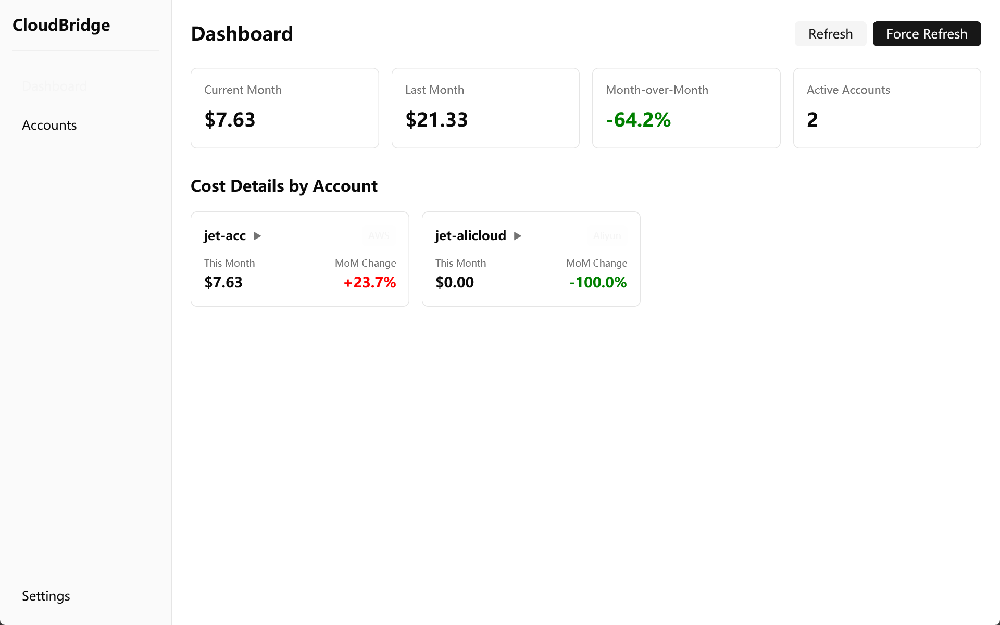

# CloudBridge

<div align="center">


[](https://opensource.org/licenses/MIT)
[](https://www.rust-lang.org/)
[](https://github.com/JetSquirrel/cloudbridge/actions/workflows/ci.yml)
[](https://github.com/JetSquirrel/cloudbridge/actions/workflows/release.yml)
[](https://github.com/JetSquirrel/cloudbridge)

**A cross-platform desktop application for multi-cloud cost management and visualization.**

[Features](#-features) • [Screenshot](#-screenshot) • [Installation](#-installation) • [Configuration](#️-configuration) • [Usage](#-usage) • [Roadmap](#-roadmap)

</div>

---

## 📸 Screenshot

<div align="center">



</div>

## ✨ Features

- **🌐 Multi-Cloud Support**
  - Amazon Web Services (AWS) - Full support
  - Alibaba Cloud (阿里云) - Full support
  - Azure & GCP - Coming soon

- **📊 Cost Visualization**
  - Monthly cost overview with month-over-month comparison
  - Per-service cost breakdown
  - 30-day cost trend charts
  - Daily cost statistics (total, average, max, min)

- **🔒 Security First**
  - AES-256-GCM encryption for stored credentials
  - Credentials never leave your local machine
  - No cloud sync, no telemetry

- **⚡ Smart Caching**
  - Intelligent 6-hour cache mechanism
  - Minimize API calls and costs
  - Force refresh when needed

- **🎨 Modern UI**
  - Built with [GPUI](https://gpui.rs/) - Zed's GPU-accelerated UI framework
  - Native performance
  - Dark theme by default

## 📦 Installation

### Download Pre-built Binaries

Download the latest release for your platform from the [Releases](https://github.com/JetSquirrel/cloudbridge/releases) page:

| Platform | Download |
|----------|----------|
| Windows (x64) | `cloudbridge-windows-x64.exe` |
| macOS (Intel) | `cloudbridge-macos-x64` |
| macOS (Apple Silicon) | `cloudbridge-macos-arm64` |

### Prerequisites (for building from source)

- **Rust** 1.75 or later
- **Windows SDK** (Windows only, for shader compilation)
  - The `fxc.exe` shader compiler must be in PATH
  - Usually located at: `C:\Program Files (x86)\Windows Kits\10\bin\10.0.xxxxx.0\x64\`

### Build from Source

```bash
# Clone the repository
git clone https://github.com/JetSquirrel/cloudbridge.git
cd cloudbridge

# Build release version
cargo build --release

# Run the application
cargo run --release
```

The compiled binary will be at `target/release/cloudbridge.exe`.

## ⚙️ Configuration

### AWS Configuration

1. Create an IAM user with Cost Explorer access
2. Attach the following IAM policy:

```json
{
    "Version": "2012-10-17",
    "Statement": [
        {
            "Effect": "Allow",
            "Action": [
                "ce:GetCostAndUsage",
                "ce:GetCostForecast",
                "ce:GetDimensionValues",
                "ce:GetTags"
            ],
            "Resource": "*"
        }
    ]
}
```

3. Generate Access Key ID and Secret Access Key
4. Add the account in CloudBridge

> **Note:** AWS Cost Explorer API costs $0.01 per request. CloudBridge minimizes API calls through intelligent caching.

### Alibaba Cloud Configuration

1. Log in to [Alibaba Cloud Console](https://ram.console.aliyun.com/)
2. Create a RAM user for API access
3. Attach the `AliyunBSSReadOnlyAccess` policy
4. Create an AccessKey for the RAM user
5. Add the account in CloudBridge

> **Note:** Alibaba Cloud billing API is free of charge.

## 🚀 Usage

### Adding a Cloud Account

1. Launch CloudBridge
2. Navigate to "云账号" (Cloud Accounts) in the sidebar
3. Select your cloud provider (AWS or Alibaba Cloud)
4. Enter account name and credentials
5. Click "验证并添加" (Validate & Add)

### Viewing Cost Data

1. Go to "仪表盘" (Dashboard)
2. View the overview cards showing:
   - Current month total cost
   - Last month total cost
   - Month-over-month change
   - Active accounts count
3. Click on any account card to expand service-level details
4. Click "趋势" (Trend) to view the 30-day cost chart

### Refreshing Data

- **Automatic:** Data is cached for 6 hours and auto-refreshes when stale
- **Manual:** Click "刷新" (Refresh) button to force refresh all data

## 🗺️ Roadmap

### v0.2.0 (Planned)
- [ ] Azure support
- [ ] Google Cloud Platform support
- [ ] Cost alerts and notifications
- [ ] Budget tracking

### v0.3.0 (Planned)
- [ ] Export reports (CSV, PDF)
- [ ] Cost forecasting
- [ ] Tag-based cost allocation
- [ ] Multi-currency support

### Future
- [ ] macOS and Linux native builds
- [ ] Cost optimization recommendations
- [ ] Team collaboration features
- [ ] API for integrations

## 📁 Data Storage

CloudBridge stores all data locally:

| Platform | Location |
|----------|----------|
| Windows | `%APPDATA%\com.cloudbridge\CloudBridge\` |
| macOS | `~/Library/Application Support/com.cloudbridge.CloudBridge/` |
| Linux | `~/.local/share/cloudbridge/` |

Files:
- `cloudbridge.duckdb` - Local database (credentials encrypted)
- `config.json` - Application configuration (contains encryption key)

> ⚠️ **Important:** Never share your `config.json` together with the database file, as this would expose your encrypted credentials.

## 🔐 Security

- Credentials are encrypted using AES-256-GCM before storage
- Encryption key is generated locally and stored in `config.json`
- No data is transmitted except direct API calls to cloud providers
- The executable contains no embedded credentials

## 🤝 Contributing

Contributions are welcome! Please feel free to submit a Pull Request.

1. Fork the repository
2. Create your feature branch (`git checkout -b feature/amazing-feature`)
3. Commit your changes (`git commit -m 'Add some amazing feature'`)
4. Push to the branch (`git push origin feature/amazing-feature`)
5. Open a Pull Request

## 📄 License

This project is licensed under the MIT License - see the [LICENSE](LICENSE) file for details.

## 🙏 Acknowledgments

- [GPUI](https://gpui.rs/) - The GPU-accelerated UI framework from Zed
- [GPUI Component](https://longbridge.github.io/gpui-component/) - UI component library
- [DuckDB](https://duckdb.org/) - Embedded analytical database

---

<div align="center">

**[⬆ Back to Top](#cloudbridge)**

Made with ❤️ for the FinOps community

</div>
