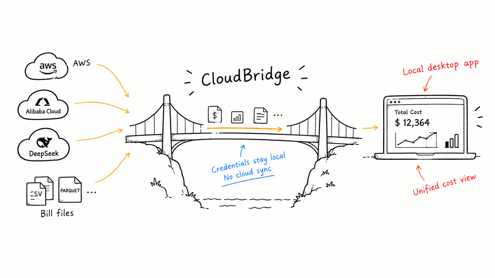

# CloudBridge

**Your cloud and AI costs, in one local ledger.**

[](https://github.com/JetSquirrel/cloudbridge/actions/workflows/ci.yml)
[](https://github.com/JetSquirrel/cloudbridge/releases/latest)
[](LICENSE)

CloudBridge is an open-source desktop app for developers who want to understand
what they spend on cloud infrastructure and model APIs. Connect billing accounts
or import provider exports, compare costs across sources, and trace spending to
services, models, and business lines. No CloudBridge account or hosted backend
required.

[Download](#installation) · [Quick start](#quick-start) · [Documentation](https://cloudbridge.jetsquirrel.cloud/docs.html) · [Contributing](CONTRIBUTING.md)


## Why CloudBridge?

- **One view across providers.** Explore month-to-date, rolling 30-day, or
  12-month trends, with account and service breakdowns.
- **Spend and usage kept distinct.** See net charges alongside gross usage and
  credits. Token-only exports remain usage records, not estimated bills.
- **Explain where costs go.** Follow a Sankey from source to service or model
  to business line; unallocated usage stays visible.
- **Review changes that matter.** Configurable rules flag unusual daily spend,
  low prepaid balances, and unallocated costs. Rules run when the app opens
  and when the Alerts page loads—not while it is closed.
- **Report in one currency.** Original billing amounts are preserved; a dated,
  built-in exchange-rate table converts them for display. Missing rates are
  reported rather than silently treated as 1:1. Rates are not live market data.
- **Keep control of your data.** A local DuckDB ledger, credentials in the OS
  keyring, no cloud sync, and no telemetry. A native GPUI interface supports
  light and dark themes.

## Supported sources

| Source | Connection | Available detail |
| --- | --- | --- |
| Amazon Web Services | Cost Explorer API | Costs by service and charge category |
| Alibaba Cloud (阿里云) | Billing API or bill import | Product totals; imported bill details include Model Studio (百炼) models |
| Volcengine (火山引擎) | Bill import | Ark (火山方舟) endpoints and token types |
| OpenAI | Cost or usage export | Project and model costs or token usage |
| Anthropic (Claude) | Cost or usage export | Workspace and model costs or token usage |
| DeepSeek | Balance API or bill import | Prepaid balance; imported daily, per-model spend |

File imports need no provider credentials. DeepSeek's API reports a balance,
not a spending breakdown. Azure and Google Cloud are not currently supported.

**Unreleased:** the development tree also supports AWS Data Exports (FOCUS 1.2
with AWS columns) from an S3 bucket. This replaces Cost Explorer for accounts
with an export URI; S3 storage and request charges can still apply. See the
[roadmap](docs/roadmap.md) and [changelog](CHANGELOG.md) for release status.

## Installation

Download from the official [GitHub Releases](https://github.com/JetSquirrel/cloudbridge/releases/latest) page:

| Platform | Download |
| --- | --- |
| macOS · Apple Silicon | [cloudbridge-macos-arm64.dmg](https://github.com/JetSquirrel/cloudbridge/releases/latest/download/cloudbridge-macos-arm64.dmg) |
| Windows · x64 | [cloudbridge-windows-x64.exe](https://github.com/JetSquirrel/cloudbridge/releases/latest/download/cloudbridge-windows-x64.exe) |

**macOS:** Open the disk image and drag **CloudBridge** to **Applications**.
Current official macOS releases are Developer ID signed and notarized. If macOS
blocks a current release, report the exact warning; do not remove quarantine
protection as a routine installation step.

**Windows:** Run the executable. SmartScreen may warn about an unsigned or
unrecognized download. Verify that it came from the official release page
before deciding whether to continue.

Linux and Intel Mac binaries are not published. Source builds on those platforms
are not guaranteed to work; see [development setup](CONTRIBUTING.md#development-setup)
for prerequisites and validation guidance.

## Quick start

### Explore without credentials

Launch the app and open **Settings → Demo data** to load sample accounts and
billing history. Demo accounts have no credentials and are skipped by provider
refreshes. Clear the demo data from the same page when you are ready.

### Connect your own data

1. Open **Accounts**, choose a source, and enter an account name.
2. For API access, configure credentials using the
   [account setup guide](https://cloudbridge.jetsquirrel.cloud/docs.html#configuration)
   and [permission templates](docs/policies.md). Use least-privilege credentials.
3. Save the account. Use **Refresh** for API data, or **Import bill** on the
   account row for a downloaded export.
4. Open **Overview** and select **MTD**, **30d**, or **12m**. Choose your reporting
   currency under **Settings → Reporting**.

### Before importing a bill

- **Imports replace whole months for the selected account.** Export the full
  bill: a product-filtered file replaces that month's existing data with only
  that product. Re-import a corrected export to update a month.
- **Refresh never overwrites an imported month**, including **Force Refresh**.
- **Usage is not spend.** An export with token counts but no monetary amounts
  does not contribute billed costs.
- **Text exports must be UTF-8.** Re-save GBK files as CSV UTF-8 before importing.
- **Import DeepSeek's ZIP as downloaded.** CloudBridge reads `cost-*.csv`;
  `amount-*.csv` contains token counts, not money.

The [import guide](https://cloudbridge.jetsquirrel.cloud/docs.html#import)
lists export locations, supported details, and troubleshooting steps.

Refresh uses a **24-hour freshness window** by default, configurable to
6, 12, 24, or 48 hours in **Settings → Refreshing**. **Force Refresh** bypasses
that window for API-backed periods and can incur additional provider charges.
CloudBridge itself is free; provider API fees are separate.

## How it works



Provider responses and imported files are retained locally. A normalization
layer maps them into a shared ledger using column names from
[FOCUS](https://focus.finops.org/), the open cost and usage specification.
CloudBridge uses this vocabulary; it does not implement the full specification.

Ingestion replaces an account's billing period transactionally, avoiding duplicate
charges on re-import. Raw data can be reprocessed after a mapping correction
without another provider fetch. Charts, attribution, and alerts read the ledger
rather than making their own billing API calls.

## Privacy and local storage

- Saved provider credentials are held in the OS keyring, separate from the
  billing databases. The app uses them to authenticate requests directly to
  configured providers.
- Billing records and raw exports stay in the local application-data directory.
  There is no CloudBridge sync service or telemetry.
- **Local does not mean encrypted.** CloudBridge does not encrypt the ledger or
  raw billing files. Use OS disk encryption and protect your backups.
- Bills can contain account identifiers, resource names, and tags. Redact these
  as well as credentials before sharing logs, screenshots, or sample exports.

See [storage and backups](https://cloudbridge.jetsquirrel.cloud/docs.html#storage)
and [security notes](https://cloudbridge.jetsquirrel.cloud/docs.html#security).

## Documentation

| I want to… | Read |
| --- | --- |
| Install and configure an account | [Setup guide](https://cloudbridge.jetsquirrel.cloud/docs.html#installation) |
| Import a provider bill | [Bill file import](https://cloudbridge.jetsquirrel.cloud/docs.html#import) |
| Understand totals, attribution, and currency conversion | [User guide](https://cloudbridge.jetsquirrel.cloud/docs.html#usage) |
| Configure alerts | [Alerts and rules](https://cloudbridge.jetsquirrel.cloud/docs.html#alerts) |
| Set up provider permissions | [IAM and API access](docs/policies.md) |
| See what changed or what is planned | [Changelog](CHANGELOG.md) · [Roadmap](docs/roadmap.md) |
| Build the app or add a billing source | [Contributing guide](CONTRIBUTING.md) |

## Development

Use **Rust 1.95 or newer** (current stable recommended) and the platform
prerequisites in [CONTRIBUTING.md](CONTRIBUTING.md). macOS builds need Xcode Command Line Tools
and CMake; Windows builds need the C++ build tools and Windows SDK, including
`fxc.exe` on `PATH`.

```bash
git clone https://github.com/JetSquirrel/cloudbridge.git
cd cloudbridge
cargo build --release
cargo run --release
```

The executable is written to `target/release/cloudbridge` on macOS or
`target/release/cloudbridge.exe` on Windows. The browser demo is a separate
WebAssembly target with an in-memory demo backend; it requires nightly Rust
and a matching `wasm-bindgen` CLI. See the contributing guide before building it.

## Contributing

Bug reports, documentation improvements, and billing-source contributions are
welcome. Start with the [contributing guide](CONTRIBUTING.md) for setup,
validation commands, and guidance on sharing sanitized billing fixtures.
For larger changes, open an [issue](https://github.com/JetSquirrel/cloudbridge/issues)
to discuss scope first.

CloudBridge focuses on single-machine cost analysis. Shared deployments, team
collaboration, invoice reconciliation, and a general chargeback engine are
outside the current scope.

## License and acknowledgments

CloudBridge is licensed under [MIT](LICENSE).

Built with [GPUI](https://gpui.rs/) and
[GPUI Kit](https://crates.io/crates/gpui-kit) for the native interface,
[DuckDB](https://duckdb.org/) for local analytics, and
[FOCUS](https://focus.finops.org/) terminology for the billing ledger.
