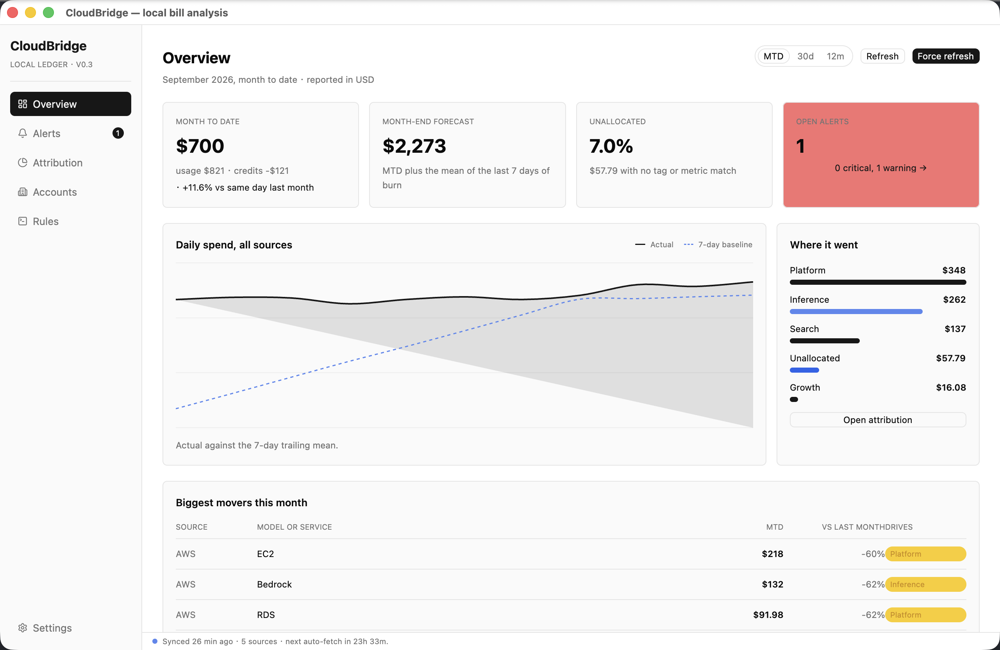

# CloudBridge

<div align="center">


[](https://opensource.org/licenses/MIT)
[](https://www.rust-lang.org/)
[](https://github.com/JetSquirrel/cloudbridge/actions/workflows/ci.yml)
[](https://github.com/JetSquirrel/cloudbridge/actions/workflows/release.yml)
[](https://github.com/JetSquirrel/cloudbridge)

**A cross-platform desktop application for multi-cloud cost management and visualization.**

[Features](#-features) • [Screenshot](#-screenshot) • [Installation](#-installation) • [Configuration](#️-configuration) • [Usage](#-usage) • [Roadmap](#-roadmap)

</div>

---

## 📸 Screenshot

<div align="center">



</div>

## ✨ Features

- **🌐 Multi-Cloud Support**
  - Amazon Web Services (AWS) - Full support
  - Alibaba Cloud (阿里云) - Full support
  - DeepSeek - Full support (balance tracking)
  - Azure & GCP - Coming soon

- **📊 Cost Visualization**
  - Monthly cost overview with month-over-month comparison
  - Per-service cost breakdown
  - Cost trend charts
  - Daily cost statistics (total, average, max, min)

- **💱 One Currency**
  - Charges are stored in the currency they were billed in and converted
    for display, each at a rate dated no later than the charge itself
  - Pick your reporting currency in Settings; nothing is rewritten
  - A charge no rate covers is reported, never counted at par

- **🧾 A Real Ledger**
  - Every source normalizes into one fact table named after
    [FOCUS](https://focus.finops.org/) columns, so credits, refunds, taxes
    and fees are each labelled as themselves
  - Raw provider responses are kept as Parquet, so a mapping fix replays
    what is on disk instead of paying for another fetch
  - Re-ingesting an unchanged bill produces identical rows

- **🔒 Security First**
  - Credentials live in your OS keyring, never in the database
  - Credentials never leave your local machine
  - No cloud sync, no telemetry

- **⚡ Frugal with Paid APIs**
  - A period is re-fetched at most once every 6 hours
  - Cost Explorer is asked for everything in one request per period
  - Force refresh when you need it now

- **🎨 Modern UI**
  - Built with [GPUI](https://gpui.rs/) - Zed's GPU-accelerated UI framework
  - Native performance
  - Light and dark themes

## 📦 Installation

### Download Pre-built Binaries

Download the latest release for your platform from the [Releases](https://github.com/JetSquirrel/cloudbridge/releases) page:

| Platform | Download |
|----------|----------|
| Windows (x64) | `cloudbridge-windows-x64.exe` |
| macOS (Apple Silicon) | `cloudbridge-macos-arm64.zip` |

> Intel Macs and Linux are not published as binaries; both build from
> source.

> **Note for Windows users:** Windows SmartScreen may show a warning for unsigned executables. Click "More info" → "Run anyway" to proceed. The application is safe and [open source](https://github.com/JetSquirrel/cloudbridge).

> **Note for macOS users:** Unzip the downloaded file first. If Finder reports the file as a text document or shows an encoding error, run `chmod +x cloudbridge-macos-*` and launch it from Terminal with `./cloudbridge-macos-*`. You may still need to right-click → "Open" the first time, or run `xattr -cr cloudbridge-macos-*` to remove quarantine flags.

### Prerequisites (for building from source)

- **Rust** 1.75 or later
- **Windows SDK** (Windows only, for shader compilation)
  - The `fxc.exe` shader compiler must be in PATH
  - Usually located at: `C:\Program Files (x86)\Windows Kits\10\bin\10.0.xxxxx.0\x64\`

### Build from Source

```bash
# Clone the repository
git clone https://github.com/JetSquirrel/cloudbridge.git
cd cloudbridge

# Build release version
cargo build --release

# Run the application
cargo run --release
```

The compiled binary will be at:
- Windows: `target/release/cloudbridge.exe`
- macOS/Linux: `target/release/cloudbridge`

## ⚙️ Configuration

### AWS Configuration

1. Create an IAM user with Cost Explorer access
2. Attach the following IAM policy:

```json
{
    "Version": "2012-10-17",
    "Statement": [
        {
            "Effect": "Allow",
            "Action": [
                "ce:GetCostAndUsage",
                "ce:GetCostForecast",
                "ce:GetDimensionValues",
                "ce:GetTags"
            ],
            "Resource": "*"
        }
    ]
}
```

3. Generate Access Key ID and Secret Access Key
4. Add the account in CloudBridge

> **Note:** AWS Cost Explorer API costs $0.01 per request. CloudBridge minimizes API calls through intelligent caching.

### Alibaba Cloud Configuration

1. Log in to [Alibaba Cloud Console](https://ram.console.aliyun.com/)
2. Create a RAM user for API access
3. Attach the `AliyunBSSReadOnlyAccess` policy
4. Create an AccessKey for the RAM user
5. Add the account in CloudBridge

> **Note:** Alibaba Cloud billing API is free of charge.

### DeepSeek Configuration

1. Log in to [DeepSeek Platform](https://platform.deepseek.com/)
2. Navigate to **API Keys** section
3. Create a new API key
4. Add the account in CloudBridge using the API key

> **Note:** DeepSeek displays your account balance (including granted and topped-up balances) instead of cost data. The balance query API is free of charge.

## 🚀 Usage

### Adding a Cloud Account

1. Launch CloudBridge
2. Navigate to **Accounts** in the sidebar
3. Select your cloud provider (AWS, Alibaba Cloud, or DeepSeek)
4. Enter account name and credentials
5. Click **Validate & Add**

### Viewing Cost Data

1. Go to **Dashboard**
2. View the overview cards showing:
   - Current month total cost (or balance for DeepSeek accounts)
   - Last month total cost
   - Month-over-month change
   - Active accounts count
3. Click on any account card to expand service-level details (or balance breakdown for DeepSeek)
4. The expanded card charts the daily cost trend, read from the ledger
   (DeepSeek reports a balance, so it has no trend)

### Choosing a Reporting Currency

Go to **Settings → Reporting** and pick the currency totals are shown in.
Charges keep the currency they were billed in; only the view they are read
through changes, so switching back and forth costs nothing.

### Refreshing Data

- **Automatic:** A billing period is re-fetched at most once every 6 hours
- **Manual:** **Refresh** picks up anything stale; **Force Refresh**
  re-fetches regardless, at the cost of another paid API call

## 🗺️ Roadmap

CloudBridge is becoming a personal finance platform for everything an
individual developer spends on infrastructure and AI — public cloud, model
provider APIs, token plans and subscriptions — in one ledger, one currency,
on one machine. See **[docs/roadmap.md](docs/roadmap.md)** for the detailed
plan and its rationale.

### P0 — FOCUS normalization (done in 0.2.0)
- [x] Source registry replacing the hardcoded provider enum
- [x] `fct_charge` fact table, batch-tracked transactional ingest
- [x] Split fetch from normalize, raw Parquet layer
- [x] AWS / Alibaba Cloud / DeepSeek mapped to FOCUS columns
- [x] Cross-currency totals via a rate table and reporting currency

### P1
- [ ] Bill file export channel (S3 / OSS + Parquet)
- [ ] Tag-based allocation with an explicit "unallocated" node
- [ ] Sankey cost flow

### P2
- [ ] Three-tier anomaly detection with attribution
- [ ] Budget alerts
- [ ] Month-end snapshot freezing

### P3
- [ ] Linux native builds
- [ ] Pluggable source adapters
- [ ] Local coding-agent token usage (reserved extension point)

Explicitly **out of scope**: multi-user or shared deployments, invoice
reconciliation, a general chargeback rule engine, team collaboration.

## 📁 Data Storage

CloudBridge stores all data locally:

| Platform | Location |
|----------|----------|
| Windows | `%APPDATA%\CloudBridge\data\` |
| macOS | `~/Library/Application Support/CloudBridge/` |
| Linux | `~/.local/share/CloudBridge/` |

Files:
- `billing.duckdb` - The ledger: every charge, in the currency it was billed in
- `cloudbridge.duckdb` - Accounts and settings
- `raw/` - Provider responses as fetched, partitioned by source, account
  and billing period
- `config.json` - Application configuration

Credentials are not in any of them: they are stored in the OS keyring
(Windows Credential Manager, macOS Keychain, Linux Secret Service).

> ⚠️ **Important:** Never share your `config.json` together with the database file, as this would expose your encrypted credentials.

## 🔐 Security

- Credentials are encrypted using AES-256-GCM before storage
- Encryption key is generated locally and stored in `config.json`
- No data is transmitted except direct API calls to cloud providers
- The executable contains no embedded credentials

## 🤝 Contributing

Contributions are welcome! Please feel free to submit a Pull Request.

1. Fork the repository
2. Create your feature branch (`git checkout -b feature/amazing-feature`)
3. Commit your changes (`git commit -m 'Add some amazing feature'`)
4. Push to the branch (`git push origin feature/amazing-feature`)
5. Open a Pull Request

## 📄 License

This project is licensed under the MIT License - see the [LICENSE](LICENSE) file for details.

## 🙏 Acknowledgments

- [GPUI](https://gpui.rs/) - The GPU-accelerated UI framework from Zed
- [GPUI Component](https://longbridge.github.io/gpui-component/) - UI component library
- [DuckDB](https://duckdb.org/) - Embedded analytical database

---

<div align="center">

**[⬆ Back to Top](#cloudbridge)**

</div>
